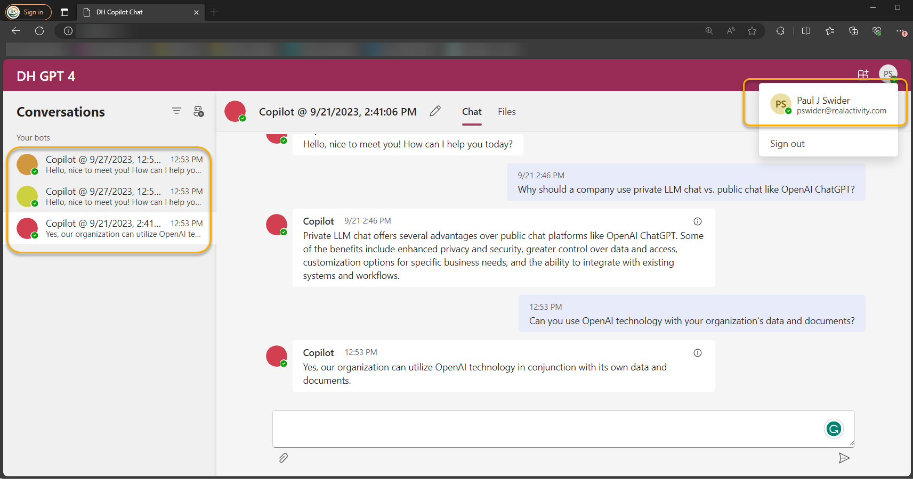

# Journey Into Generative AI - Building Your Own Copilot
## Introduction

In this workshop, we will unfurl a meticulously crafted **checklist**, a treasure map guiding C-suite executives, board of directors, and staff through the meticulous preparation and deployment of generative AI technologies. Moreover, witness the prowess of **Copilot** in a live demo, showcasing a tangible manifestation of AI’s capabilities, providing a glimpse into the future where your decisions are empowered, operations streamlined, and customer interactions are revolutionized. Set sail with us, as we embark on a journey where technology and strategy converge, navigating through the currents and tides of AI, charting a course towards uncharted territories of endless possibilities.

**Speaker:** [Paul Swider](https://www.linkedin.com/in/pswider/) email: pswider@realactivity.com

**Schedule:** Follow-up AI envisioning session with Paul Swider http://try.realactivity.ai

**Agenda for Southeast Asia Autumn 2023:** [Manila, Kuala Lumpur and Singapore]([Get the agenda for Southeast Asia Autumn 2023](Agenda for Journey Into Generative AI Executive Bootcamp.md). Manila, Kuala Lumpur and Singapore.md)

**PowerPoint Slides:** [Download](https://www.linkedin.com/smart-links/AQF3zmjJZyYikQ)

**Notes:**

- This AI bootcamp for executives and leadership uses a combination of custom slides for leaders and executives and technical content from Microsoft Inspire Sessions [BRK217H](https://build.microsoft.com/en-US/sessions/31e11443-70d3-4020-8c8c-0a654bccd233?source=sessions) and [KEYO2H](https://build.microsoft.com/en-US/sessions/bb8f9d99-0c47-404f-8212-a85fffd3a59d?source=sessions)
- Follow the [semantic-kernel Microsoft Learn site](https://learn.microsoft.com/en-us/semantic-kernel/overview/) for up to date information on copilot development.

- Follow the [LangChain](https://docs.langchain.com/docs/)  and [Hugging Face](https://huggingface.co/) site to stay up to date on all things related to LLM development.
- Remember AI is evolving quickly, so check back often.

**Demo App:**

