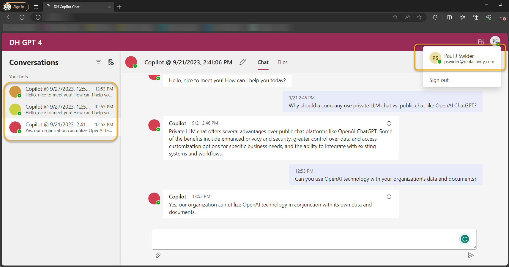

# Journey Into Generative AI - Building Your Own Copilot
## Introduction

This GitHub repository by RealActivity serves as a comprehensive guide and resource hub for diving into modern AI and intelligent apps. The workshop, led by Paul Swider, is designed to navigate C-suite executives, board directors, and staff through the intricate process of preparing and deploying generative AI technologies. It provides a checklist that acts as a strategic guide through this technological journey, alongside a live demo of Copilot, showcasing tangible AI capabilities. The repository includes a detailed agenda for the Southeast Asia Autumn 2023 workshop, covering locations like Manila, Kuala Lumpur, and Singapore, and also provides downloadable PowerPoint slides. Additional resources and links for both executive and technical audiences are provided, ensuring a well-rounded understanding and application of the knowledge shared. The bootcamp blends custom slides for leaders with technical content from specific Microsoft Inspire Sessions and encourages participants to stay abreast of the rapidly evolving field of AI by following various platforms and sites dedicated to Copilot and LLM development.

**Speaker:** [Paul Swider](https://www.linkedin.com/in/pswider/) email: pswider@realactivity.com

**Schedule meeting:** Follow-up AI envisioning session with Paul Swider http://try.realactivity.ai

Technical resources for [Boston Code Camp 2024](technical%20resource.md)

**Agenda for Southeast Asia Autumn 2023:** [Manila, Kuala Lumpur and Singapore]([Get the agenda for Southeast Asia Autumn 2023](Agenda for Journey Into Generative AI Executive Bootcamp.md). Manila, Kuala Lumpur and Singapore.md)

**PowerPoint Slides:** [Download](https://www.linkedin.com/smart-links/AQF3zmjJZyYikQ)

**Notes:**

- This AI bootcamp for executives and leadership uses a combination of custom slides for leaders and executives and technical content from Microsoft Inspire Sessions [BRK217H](https://build.microsoft.com/en-US/sessions/31e11443-70d3-4020-8c8c-0a654bccd233?source=sessions) and [KEYO2H](https://build.microsoft.com/en-US/sessions/bb8f9d99-0c47-404f-8212-a85fffd3a59d?source=sessions)
- Follow the [semantic-kernel Microsoft Learn site](https://learn.microsoft.com/en-us/semantic-kernel/overview/) for up to date information on copilot development.

- Follow the [LangChain](https://docs.langchain.com/docs/)  and [Hugging Face](https://huggingface.co/) site to stay up to date on all things related to LLM development.
- Remember AI is evolving quickly, so check back often.

**Demo App:**

Copyright (c) RealActivity. All rights reserved.
